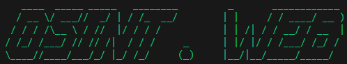
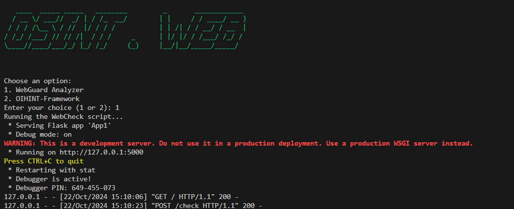

## OSINT Web Investigation Tool



**OSINT Web** is a Python-based tool developed for educational purposes, specifically to aid in cybercrime investigations. The tool is designed to help security professionals, law enforcement, and ethical hackers gather publicly available information on a target. Leveraging Open Source Intelligence (OSINT), it integrates various APIs, wordlists, and databases to streamline the investigation process.

This tool consists of three main components:
1. **app1.py** - Contains specific functionalities for data collection and analysis.
2. **app2.py** - Handles additional data processing and API integrations.
3. **mainfile.py** - The primary orchestrator that combines `app1.py` and `app2.py` functionalities.

> **Note:** This tool is intended for educational use only and should only be used in lawful investigations.

---

## Features

- **Comprehensive OSINT Investigation**: Uses a range of APIs and databases to gather relevant information on the target.
- **Data Enrichment**: Expands basic data using OSINT techniques to provide deeper insights.
- **Modular Design**: `app1.py` and `app2.py` components separate key functionalities, allowing for streamlined and efficient data processing.
- **Wordlist Integration**: Customizable wordlists help enhance data matching and analysis.

## Requirements

- Python 3.x
- Required Python libraries (install via `requirements.txt`)
- API keys for integrated services (listed below)

### APIs Utilized

- [Hunter.io]
- [Censys]
- [Api Layer/Number Verifier]

> **Note:** Replace `Hunter.io`, `Censys` andand `ApiLayer` with the actual APIs used in your tool.

---

## Installation

1. **Clone the Repository**:
   ```bash
   git clone https://github.com/yourusername/OSINT.Web.git
   cd OSINT.Web
   ```

2. **Install Dependencies**:
   ```bash
   pip install -r requirements.txt
   ```

3. **Setup API Keys**:
   - Obtain API keys for the necessary services listed above.
   - Add these API keys to a `.env` file or a configuration file as per the tool's requirement.

---

## Usage

### Run the Tool

  **Run Main Script**:
   The primary file, `mainfile.py`, orchestrates the modules and provides a full-featured OSINT investigation tool.

   ```bash
   python mainfile.py
   ```



---

## Disclaimer

This tool is for **educational and lawful investigation purposes only**. Misuse of this tool may be a violation of federal and/or local laws. The developers and contributors are not responsible for any illegal activity conducted with this tool.
